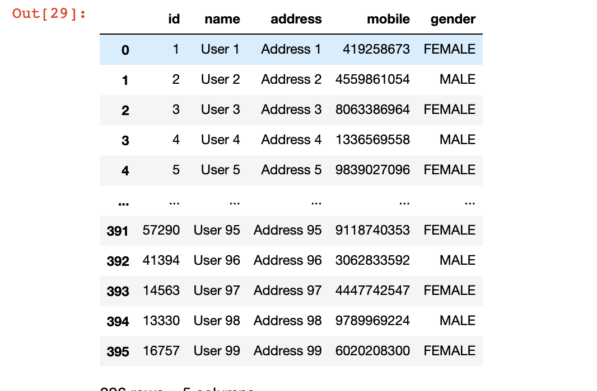

#### Install Dependencies

```python
pip3 install sqlalchemy
pip3 install psycopg2-binary
pip3 install pandas
```

#### Connect with PostgreSQL

```python
from sqlalchemy import create_engine
from sqlalchemy.ext.declarative import declarative_base
from sqlalchemy.orm import sessionmaker
from sqlalchemy import MetaData
import pandas as pd

db_host = "localhost"
db_name = "your_db_name"
db_pass = "your_db_password"
db_user = "your_db_user"

engine = create_engine(f"postgresql://{db_user}:{db_pass}@{db_host}/{db_name}")
Base = declarative_base()
metadata = MetaData(engine)

Session = sessionmaker(bind=engine)
session = Session()
```

#### Create User Model

```python
from sqlalchemy import Column, BigInteger, String

class User(Base):
    __tablename__ = "users"
    __table_args__ = {'extend_existing': True} 
    id = Column(BigInteger, primary_key=True)
    name = Column(String, nullable=False)
    address = Column(String, nullable=False)
    mobile = Column(BigInteger, nullable=False) 
    gender = Column(String, nullable=False)
```

#### Create table
```python
Base.metadata.create_all(engine)
```

#### Insert Data
```python
import random as r

def generate_number():
    numbers = []
    for i in range(0,10):
        numbers.append(str(r.randint(0, 9)))
    return int("".join(numbers))

    
def insert_users():
    users = []
    for i in range(1,100):
        user = User()
        user.id = r.randint(0,100000)
        user.name = f"User {i}"
        user.address = f"Address {i}"
        user.mobile = generate_number()
        user.gender = "MALE" if i%2==0 else "FEMALE"
        users.append(user)
    session.add_all(users)
    session.commit()
insert_users() 
```

#### Load SQL-Rows in Pandas DataFrame
```python
users_df = pd.read_sql('select * from users', con=engine)
users_df
```

